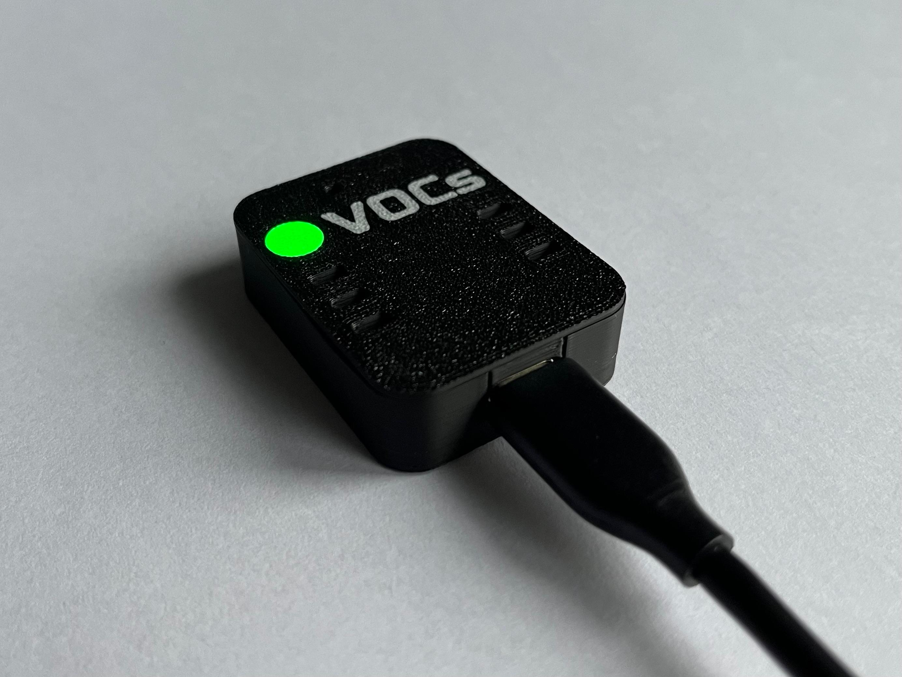
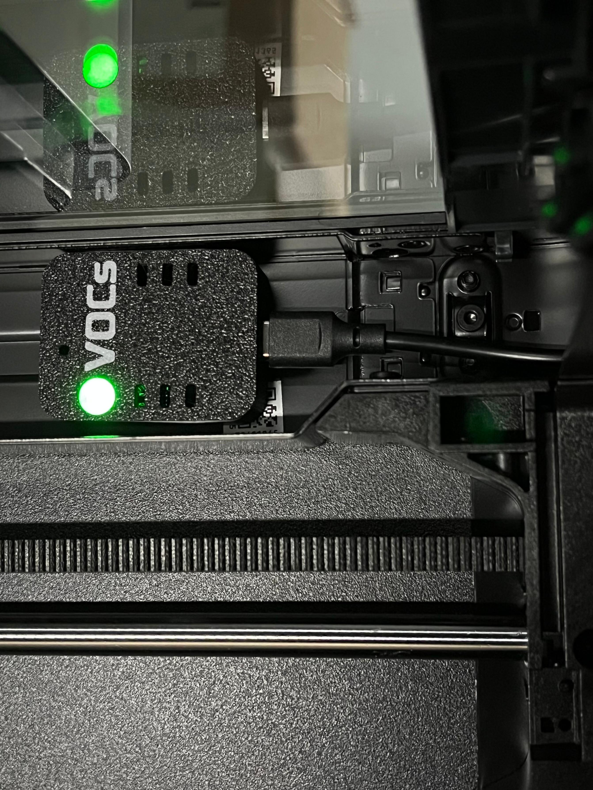

# What is VOCaware?

VOCaware is a small device that measures volatile organic components (VOCs) in the ambient air and indicates potentially unhealthy exposure.

VOCs are released during 3D printing caused by the melting process of plastic filaments. The exposure depends on the material and the melting temperature. Since there are no long term studies on the implications of VOC exposure to the human being it‘s reasonable to mitigate the risk of potential long term illness by avoiding these gases.

  

# Features

- WIFI enabled microcontroller (ESP32-S3) to transmit sensor data wirelessly or via serial communication
- Sensirion SGP40 VOC sensor 
- Sensirion SHT40 temperature and humdity sensor to calibrate VOC sensor
- WS2812B LED to indicate intensity of exposure
- USB C plug to power and program device
- Compact PCB design (40 mm x 30 mm)
- Compact housing ( 43 mm x 33 mm x 11 mm) with magnets to easily attach to metal objects

# PCB

- 2 layers
- 40 x 30 mm
- JLCPCB production files available

# Housing

The lid simply clips to the bottom part of the housing. On the backside are holes for magnets.

Frontside:

Backside: 

# VOC Indication

Color code of the RGB LED is programmed according to Sensirions SGP40 VOC index scale to show a trend of the intensity over time. The devices needs severeal seconds to set up. During this, the LED blinks green.  

| LED Color| VOC Index | Exposure |
|----------|----------|----------|
| blue     | 0 - 70  | decreased |
| green    | 70 - 140 | OK |
| yellow    | 131 - 210 | slightly increased |
| orange    | 221 - 280 | increased |
| red    | 281 - 350 | significantly increased |
| red blink  | 351 - 500 | concerningly increased  |

# Compatible to Bambu Lab P1S 3D Printer

Device fits in enclosure of the P1S printer and can be power directly from the internal USB plug. Please print the housing with PETG filament or similar so that it withstands the increased temperatures in the chamber.

The VOCaware is also visible in the camera view of the Bambu Studio interface:

# What's Next
Ideas for improvements and features:

- Control Bento Box via VOCaware GPIO according to VOC Index
- Connect to MQTT Broker

# Known Issues

Unfortunatly the ground layer is not sufficiently interconnected. It can be easily fixed by soldering a short wire from the GND test pin to the ground zone as shown in the image:

